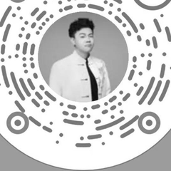

<h1 align="center">Hi there 👋, I'm Leo</h1>
<h3 align="center">AI Product Manager · Beijing, China</h3>

  <em>Turning complex AI into <b>understandable</b>, <b>evaluable</b>, and <b>actionable</b> knowledge.</em>

---

### 🧭 About Me

- 🤖 **AI Product Manager** — I turn complex AI technology into knowledge that people can truly **understand, evaluate, and act on**.
- 🧠 Currently exploring **AI Agents**, **AIGC**, and applied **LLM** products.
- 📍 Based in **Beijing, China**
- 📬 Reach me at **2907594338@qq.com**

---

### 📦 Open Source

🚧 *Preparing my first open-source project — stay tuned.*

---

### 📫 Contact Me

  
  
  

  <strong>WeChat</strong> &nbsp;·&nbsp; <strong>Douyin</strong> &nbsp;·&nbsp; <strong>Xiaohongshu</strong>

